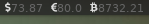

# Polybar XO Currency




### Setup

```
git clone https://github.com/XO490/polybar-xo-currency.git
cd polybar-xo-currency/app
cp polybar-xo-currency.py ~/.config/polybar/scripts
```


### Module

Add to your polybar config:

```
modules-right = usdrate eurrate btcrate

# Polybar-XO-Currency
[module/usdrate]
format = <label>
label = %{F#666666}%output%
type = custom/script
exec = "python ~/.config/polybar/scripts/polybar-xo-currency.py rub usd"
interval=600

[module/eurrate]
format = <label>
label = %{F#666666}%output%
type = custom/script
exec = "python ~/.config/polybar/scripts/polybar-xo-currency.py rub eur"
interval=600

[module/btcrate]
format = <label>
label = %{F#666666}%output%
type = custom/script
exec = "python ~/.config/polybar/scripts/polybar-xo-currency.py usd btc"
interval=600
```


### Icons

For icons usage **ttf-font-awesome**
https://fontawesome.com/cheatsheet

```
sudo pacman -S ttf-font-awesome
```

And add to your polybar config:
https://github.com/polybar/polybar/wiki/Fonts

```
FontAwesome5Pro:style=Solid:size=7.5;2.5
```


### Usage

```
python polybar-xo-currency.py rub usd
73.78
python polybar-xo-currency.py rub usd 10
738.73
python polybar-xo-currency.py usd eur
1.08
python polybar-xo-currency.py eth btc
46.23
```

etc..


### All Supported Currencies

**Select by code**

- **A**
  ABBC ADA AE AED AFN AION ALGO ALL AMD ANG ANT AOA ARDR ARK ARS ATOM AUD AWG AZN

- **B**
  BAM BAT BBD BCD BCH BCN BCV BCZERO BDT BDX BEAM BGN BHD BIF BMD BNB BND BOB BRD BRL BSD BSV BTC BTG BTM BTN BTS BTT BWP BXK BYN BYR BZD

- **C**
  CAD CCCX CDF CENNZ CHF CHZ CLF CLP CNH CNX CNY COP CRC CRO CRPT CUP CVC CVE CYP CZK
- **D**
  DAI DASH DCN DCR DEM DGB DGD DGTX DJF DKK DOGE DOP DRG DSH DTR DX DZD

- **E**
  ECS EGP EKT ELA ELF ENG ENJ EON EOS ERN ETB ETC ETH ETN ETP EUR EURS
- **F**
  FCT FET FJD FKP FNB FRF FTM FTT FUN FXC

- **G**
  GAP GBP GEL GHS GIP GMD GNF GNT GRIN GTQ GXC GYD
- **H**
  HBAR HC HEDG HKD HNL HOT HRK HT HTG HUF HYN
- **I**
  ICX IDR IEP ILS INB INO INR INX IOST IOT IQD IRR ISK ITL
- **J**
  JMD JOD JPY JWL
- **K**
  KAASO KBC KCS KES KGS KHR KMD KMF KNC KPW KRW KWD KYD KZT
- **L**
  LAK LAMB LBP LEO LINK LKR LOOM LRC LRD LSK LSL LTC LTL LUNA LVL LYD
- **M**
  MAD MAID MANA MATIC MCO MDL MEXC MGA MIOTA MKD MKR MMK MNT MOF MONA MOP MRO MUR MVR MWK MXM MXN MYR MZN

- **N**
  NAD NANO NAS NEO NET NEW NEX NEXO NGN NIO NMC NOK NPR NPXS NRG NULS NVC NZD
- **O**
  ODE OKB OMG OMR ONT OSC
- **P**
  PAB PAI PAX PEN PGK PHP PKR PLC PLN PPC PPT PYG PZM
- **Q**
  QAR QASH QNT QTUM
- **R**
  RDD REN REP RIF RLC RON RSD RUB RVN RWF
- **S**
  SAR SBD SC SCR SDG SEELE SEK SGD SHP SIT SLL SLV SNT SNX SOLVE SOS SRD STD STEEM STRAT SVC SXP SYP SZL
- **T**
  THB THETA THR THX TJS TMT TND TNT TOP TRX TRY TTD TUSD TWD TZS
- **U**
  UAH UGX USD USDC USDT UYU UZS
- **V**
  VEF VERI VET VITAE VND VSYS VUV
- **W**
  WAN WAVES WICC WIN WIX WST WTC
- **X**
  XAF XCD XEM XIN XLAB XLM XMR XMX XOF XPF XRP XTZ XVG XZC
- **Y**
  YER
- **Z**
  ZAR ZB ZEC ZEN ZIL ZMW ZRX ZWL 